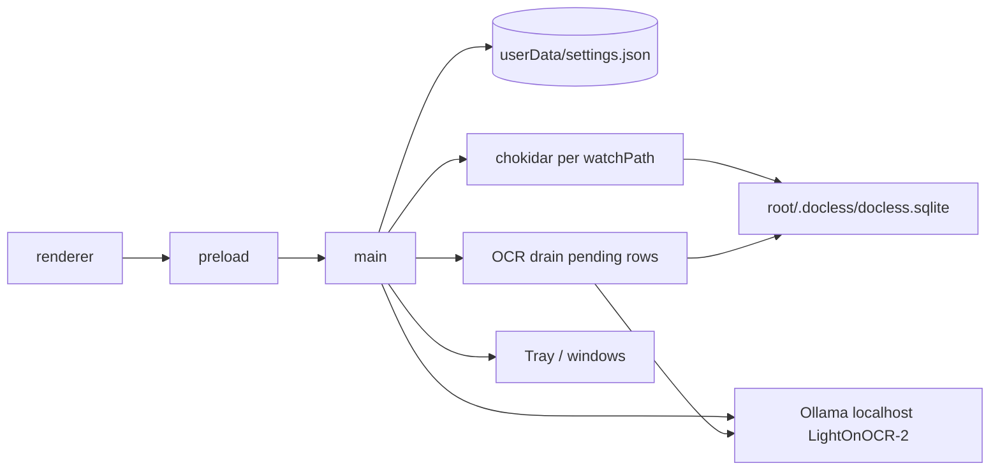

# Architecture

As-built map of Docless. See ADRs 0006–0008 for storage/watch/OCR.

## Purpose

Desktop app for local document handling: folders you choose stay on disk; OCR via a local Ollama runtime. No cloud backend.

## Process layout

```
src/main/       Electron main: windows, tray, settings, watch, ollama, notify, update
src/preload/    contextBridge → window.api
src/renderer/   React UI (TanStack Router, Zustand, shadcn)
```

| Layer | Owns |
|-------|------|
| **main** | FS, watchers, OS notifications, tray, Ollama lifecycle + OCR, `settings.json`, auto-update |
| **preload** | Thin IPC surface; no business logic |
| **renderer** | UI + client stores; talks only through `window.api` |



## Cold start

1. Main registers IPC (settings, ollama, notify), creates tray + windows.
2. `syncWatchPaths(loadSettings().watchPaths)` — open sidecar DB (migrate) + chokidar per root.
3. Renderer hydrates settings + ollama status.
4. Root route `beforeLoad` boots Ollama:
   - Binary already on disk → quiet ensure runtime + model.
   - First run → `/setup/1-ollama` then `/setup/2-ocr-model`.
5. Ready when Ollama is running and `maternion/LightOnOCR-2:1b` is present → app routes.
6. Packaged build: check GitHub latest, download in background, `notifyMain` when ready, install on quit. Dev skips.

## Windows

| Window | Role |
|--------|------|
| **main** | Full app chrome (~900×670), hiddenInset titlebar |
| **compact** | Tray popover (~390×680), frameless, `alwaysOnTop`, hide on blur; argv `--docless-window=compact` |

Tray left-click toggles compact; right-click Open App / Quit. Closing all windows does not quit; quit via tray or Cmd+Q. On quit, stop watchers and stop Ollama only if this app started it (`owned`).

## Storage today

| Path | Contents |
|------|----------|
| `app.getPath("userData")/settings.json` | App settings (`watchPaths: string[]`) |
| `<watchRoot>/.docless/` | Sidecar dir (mkdir + layout on watch start) |
| `<watchRoot>/.docless/docless.sqlite` | Per-root library DB (ADR 0008) |
| `<watchRoot>/.docless/.gitignore` | `*` so sidecar junk stays out of git |
| `userData/electron-ollama/` | Managed Ollama binary (when installed by app) |
| Ollama’s own model store | `maternion/LightOnOCR-2:1b` weights (not under app control) |

### Sidecar DB (ADR 0008)

- **File:** `.docless/docless.sqlite` (WAL; checkpoint on quit). Opened from main when a watch root starts (`src/main/db`).
- **Owner:** Electron main only (`better-sqlite3`, hand migrates). Renderer never opens the file.
- **Identity:** canonical relative path (NFC, `/`, preserve case) = primary key (`src/main/track.ts`).
- **Track:** allowlist (case-insensitive): `pdf`, `png`, `jpg`, `jpeg`, `webp`, `tif`, `tiff`, `heic`, `gif`. No symlink follow. Chokidar cold scan (`ignoreInitial: false`) + live add/change/unlink; prune missing rows on `ready`.
- **documents columns:** `path`, `mtime_ms`, `size`, `content_hash`, `ocr_status`, `ocr_error`, `text`, `created_at_ms`, `updated_at_ms`.
- **ocr_status:** `pending` \| `running` \| `done` \| `failed` \| `skipped`.
- **Change detect:** mtime+size gate → SHA-256; hash change → `pending`, keep old `text` until new OCR succeeds.
- **OCR:** main pool (`src/main/ocr.ts`, concurrency 2) claims `pending` → `running`, calls local `maternion/LightOnOCR-2:1b` via Ollama `/api/generate` only (`127.0.0.1`), writes `text` + `done` or `ocr_error` + `failed`. Images (png/jpg/jpeg/webp/gif) as-is; PDF every page rasterized (`pdfjs-dist` + `@napi-rs/canvas`) then OCR’d and joined with `\n\n`. heic/tif/tiff → failed with clear error. Kick on track pending + model ready; refill when a job finishes. Stale `running` reset to `pending` on boot. No claim while Ollama/model down (stays pending). Transient fail (timeout / Ollama down): auto-requeue up to 2 more times (5s, 15s). Manual retry: `failed` → `pending` via `documents.retry` (UI Retry on failed rows) or `documents.retryAll` (Retry all failed on the documents page, shown when any failed).
- **Delete:** unlink → hard delete row. Rename = new path (re-OCR).
- **Migrate:** forward-only `PRAGMA user_version` TS steps in transactions; backup `docless.sqlite.bak-v{k}` before each step (keep ~2); refuse DB newer than app + notify. Corrupt open → quarantine `docless.sqlite.corrupt-<ts>` + fresh DB + notify.
- **FTS (schema v2):** external-content `documents_fts` (FTS5 on `path` + `text`) kept in sync via AI/AD/AU triggers; backfill on migrate. Search unions open roots with `MATCH` (token prefix) + `bm25` order — local only, no remote index.
- **Non-goals:** page table, rename-merge, multi-instance, global `userData` index.

## IPC (`window.api`)

- `settings.get` / `settings.set` → `{ watchPaths: string[] }` (set also resyncs watchers)
- `dialog.openDirectory` → `string | null`
- `ollama.ensureRuntime` / `ensureModel` / `reinstall` / `status` / `onProgress`
- `documents.list` / `onChange` → union of open sidecars (name, root, path, ocrStatus, ocrError); push on track/watch/OCR changes
- `documents.search(q)` → FTS over path + OCR text across open sidecars (empty q = list)
- `documents.get({ root, path })` → one row + OCR `text`, or null
- `documents.open({ root, path })` → open file in OS default app (`shell.openPath`)
- `documents.retry({ root, path })` → `boolean` (`failed` → `pending` + kick)
- `documents.retryAll()` → `number` (all `failed` → `pending` + kick)
- UI: `/doc?root=&path=` detail (source context + OCR text); list/search rows navigate there
- `notify.show`
- `windowRole`: `"main"` \| `"compact"`

## Not built

Tags.

## Decisions

See [docs/adr/](adr/).
