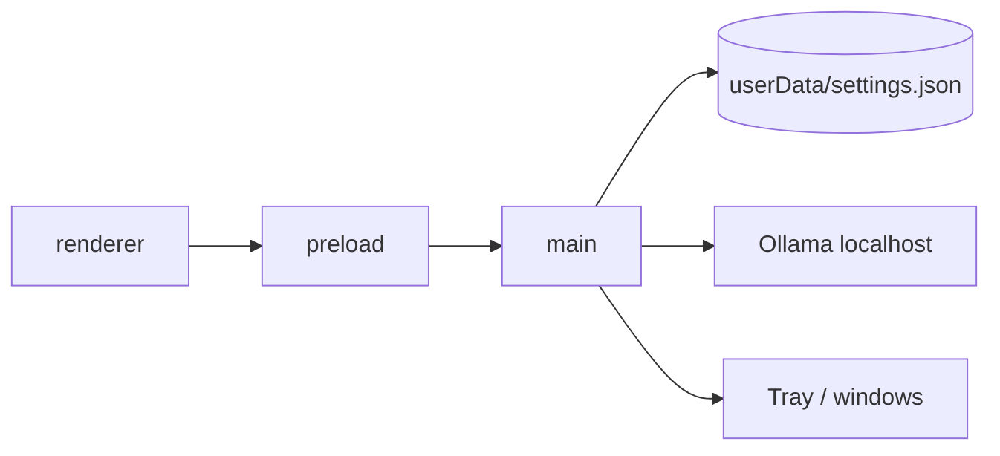

# Architecture

As-built map of Docless. Product pipeline (watch → index → search) is not built yet — see Status in the README and ADR 0006 for intent only.

## Purpose

Desktop app for local document handling: folders you choose stay on disk; OCR via a local Ollama runtime. No cloud backend.

## Process layout

```
src/main/       Electron main: windows, tray, settings, ollama, notify
src/preload/    contextBridge → window.api
src/renderer/   React UI (TanStack Router, Zustand, shadcn)
```

| Layer | Owns |
|-------|------|
| **main** | FS, OS notifications, tray, Ollama lifecycle, `settings.json` |
| **preload** | Thin IPC surface; no business logic |
| **renderer** | UI + client stores; talks only through `window.api` |



## Cold start

1. Main registers IPC (settings, ollama, notify), creates tray + windows.
2. Renderer hydrates settings + ollama status.
3. Root route `beforeLoad` boots Ollama:
   - Binary already on disk → quiet ensure runtime + model.
   - First run → `/setup/1-ollama` then `/setup/2-ocr-model`.
4. Ready when Ollama is running and `glm-ocr` is present → app routes.

## Windows

| Window | Role |
|--------|------|
| **main** | Full app chrome (~900×670), hiddenInset titlebar |
| **compact** | Tray popover (~390×680), frameless, `alwaysOnTop`, hide on blur; argv `--docless-window=compact` |

Tray left-click toggles compact; right-click Open App / Quit. Closing all windows does not quit; quit via tray or Cmd+Q. On quit, stop Ollama only if this app started it (`owned`).

## Storage today

| Path | Contents |
|------|----------|
| `app.getPath("userData")/settings.json` | App settings (`watchPaths: string[]`) |
| `userData/electron-ollama/` | Managed Ollama binary (when installed by app) |
| Ollama’s own model store | `glm-ocr` weights (not under app control) |

No document DB, no `.docless` writer, no search index yet.

## IPC (`window.api`)

- `settings.get` / `settings.set` → `{ watchPaths: string[] }`
- `dialog.openDirectory` → `string | null`
- `ollama.ensureRuntime` / `ensureModel` / `reinstall` / `status` / `onProgress`
- `notify.show`
- `windowRole`: `"main"` \| `"compact"`

## Not built

Folder watching, `.docless` layout on disk, OCR job queue, calling `glm-ocr` for pages, search/index, tags, document viewer.

## Decisions

See [docs/adr/](adr/).
